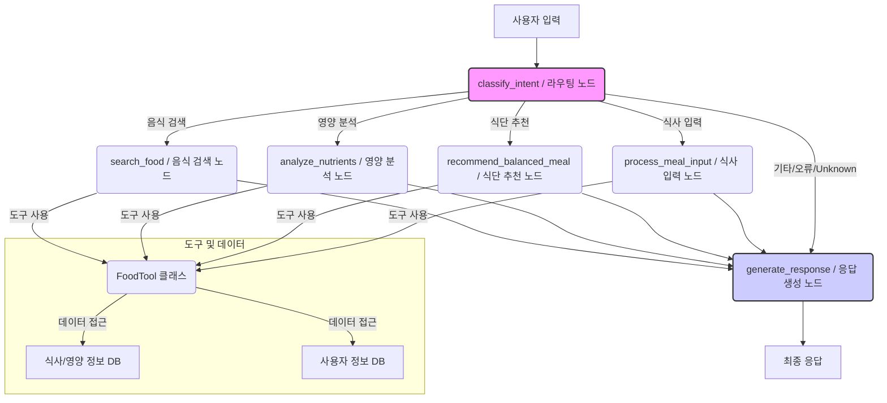

# 🧠 LangGraph 기반 식단 관리 에이전트 시스템

## 1. 프로젝트 소개

**목표:** 사용자의 식단 기록, 영양 분석, 맞춤 식단 추천 등 건강 관리 기능을 제공하는 지능형 챗봇 시스템 개발

**핵심 기술:**

*   **LangGraph:** 복잡한 LLM 애플리케이션 워크플로우를 상태 그래프(State Graph) 기반으로 유연하게 구성하고 관리합니다. 각 기능 단위를 '노드(Node)'로 정의하고, 노드 간의 흐름을 '엣지(Edge)'로 연결하여 다단계 추론 및 조건부 실행을 구현합니다.
*   **Langchain:** LLM(Large Language Model), 에이전트(Agent), 도구(Tool), 프롬프트(Prompt) 등 LLM 기반 애플리케이션 개발에 필요한 다양한 구성 요소를 제공하고 통합하는 프레임워크입니다.
*   **OpenAI GPT-4 Turbo:** 강력한 자연어 이해 및 생성 능력을 바탕으로 사용자 입력 분석, 도구 사용 결정, 최종 응답 생성 등 핵심적인 지능을 제공합니다.

**주요 기능:**

*   **식사 기록:** 사용자가 자연어로 입력한 식사 내용을 분석하여 음식 종류, 항목, 영양 정보를 추출하고 저장합니다.
*   **식단 추천:** 사용자의 선호도(알레르기, 좋아하는/싫어하는 음식 등) 및 특정 요청(예: "저녁 메뉴 추천해줘")을 고려하여 균형 잡힌 식단을 추천합니다.
*   **영양 분석:** 사용자의 식사 기록을 바탕으로 특정 기간 동안의 영양 섭취 상태를 분석하고 리포트를 제공합니다.
*   **음식 검색:** 특정 음식의 영양 정보(칼로리, 탄수화물 등)를 검색하여 제공합니다.
*   **다중 의도 처리:** 사용자의 다양한 요청(식사 기록, 추천, 분석, 검색)을 이해하고, LangGraph 워크플로우를 통해 적절한 기능 노드로 분기하여 처리합니다.

## 2. 시스템 아키텍처

본 시스템은 LangGraph를 중심으로 구성된 상태 기반 멀티 에이전트 시스템입니다. 사용자 입력은 먼저 의도 분류 노드를 거쳐 적절한 기능 수행 노드로 라우팅되며, 각 노드는 필요한 도구를 사용하거나 LLM 추론을 통해 작업을 수행하고 상태를 업데이트합니다. 최종적으로 응답 생성 노드가 전체 상태를 종합하여 사용자에게 자연스러운 답변을 제공합니다.



**흐름 설명:**

1.  **사용자 입력:** 사용자가 챗봇에게 메시지를 보냅니다.
2.  **라우팅 노드 (`classify_intent`):** LLM을 사용하여 사용자 입력의 주요 의도와 카테고리(식사 입력, 식단 추천, 영양 분석, 음식 검색, 기타)를 파악합니다.
3.  **조건부 분기:** 라우팅 결과에 따라 다음 실행할 노드를 결정합니다.
    *   **식사 입력 노드 (`process_meal_input`):** 식사 관련 입력으로 판단될 경우 실행됩니다. `FoodTool`의 `analyze_meal_input` 도구를 호출하여 음식 항목과 영양 정보를 분석하고, `save_meal_record` 도구를 호출하여 결과를 저장합니다.
    *   **식단 추천 노드 (`recommend_balanced_meal`):** 식단 추천 요청 시 실행됩니다. `FoodTool`의 `get_user_preferences` 도구로 사용자 선호도를 가져오고, `recommend_balanced_meal` 도구를 호출하여 맞춤 식단을 생성합니다.
    *   **영양 분석 노드 (`analyze_nutrients`):** 영양 분석 요청 시 실행됩니다. `FoodTool`의 `analyze_nutrients` 도구를 호출하여 지정된 기간의 영양 섭취 리포트를 생성합니다.
    *   **음식 검색 노드 (`search_food`):** 음식 정보 검색 요청 시 실행됩니다. LLM 에이전트가 검색어를 추출하고 `FoodTool`의 `search_food` 도구를 호출하여 결과를 가져옵니다.
    *   **응답 생성 노드 (`generate_response`):** 기타 의도, 처리 불가, 오류 발생 또는 각 기능 노드 실행 완료 후 호출됩니다.
4.  **응답 생성 노드 (`generate_response`):** 워크플로우의 최종 상태(수행된 작업 결과, 중간 데이터, 오류 정보 등)를 모두 종합하여 LLM을 통해 사용자에게 자연스러운 최종 응답 메시지를 생성합니다.
5.  **최종 응답:** 생성된 메시지가 사용자에게 전달됩니다.

## 3. 주요 구성 요소 및 역할

*   **`workflow.py`:**
    *   LangGraph 워크플로우의 전체 구조(상태 정의, 노드, 엣지, 분기 로직)를 정의하고 컴파일합니다.
    *   워크플로우 실행을 위한 `run_food_workflow` 함수를 제공합니다.
    *   시스템의 진입점 및 제어 센터 역할을 합니다.
*   **`nodes/food_nodes.py`:**
    *   워크플로우를 구성하는 각 노드의 실제 로직을 구현하는 함수들을 정의합니다 (`create_..._node` 팩토리 함수 형태).
    *   각 노드 함수는 상태를 입력받아 필요한 작업(LLM 호출, 도구 사용 등)을 수행하고 업데이트된 상태를 반환합니다.
    *   `run_agent_node` 헬퍼 함수: 에이전트 실행 및 기본 오류 처리를 담당합니다.
*   **`tools/food_tools.py`:**
    *   `FoodTool` 클래스: 실제 기능 수행 로직(외부 API 호출, DB 연동, 데이터 계산 등)을 메서드로 구현합니다.
    *   Langchain `Tool` 객체로 래핑되어 워크플로우 노드 또는 에이전트가 호출할 수 있도록 제공됩니다. (예: `analyze_meal_input`, `save_meal_record`, `recommend_balanced_meal` 등)
*   **`prompts/common_prompts.py`:**
    *   각 노드 또는 에이전트가 사용할 시스템 프롬프트 문자열을 상수로 정의합니다. (예: `ROUTING_PROMPT`, `MEAL_INPUT_PROMPT` 등)
*   **`models/state_models.py`:** (현재 `workflow.py` 내 `FoodAgentState` TypedDict로 대체됨)
    *   워크플로우 상태 구조를 정의하는 역할을 할 수 있습니다 (Pydantic 모델 등 사용 가능).
*   **`agent_main.py`:** (현재 LangGraph 구조에서는 직접 사용되지 않을 수 있으나, 초기 에이전트 구성 또는 별도 실행 로직 포함 가능)
    *   에이전트 실행의 메인 로직 또는 클래스 기반 에이전트 정의가 포함될 수 있습니다.

## 4. 설치 및 실행 방법

### 사전 요구 사항

*   Python 3.9 이상
*   pip (Python 패키지 관리자)
*   OpenAI API 키

### 설치

1.  **저장소 클론:**
    ```bash
    git clone <repository-url>
    cd <repository-directory>
    ```

2.  **가상 환경 생성 및 활성화 (권장):**
    ```bash
    python -m venv venv
    # Windows
    .\venv\Scripts\activate
    # macOS/Linux
    source venv/bin/activate
    ```

3.  **필요 패키지 설치:**
    ```bash
    pip install -r requirements.txt
    ```
    *(`requirements.txt` 파일이 없다면 주요 패키지를 직접 설치합니다: `pip install langchain langchain-openai langgraph python-dotenv openai requests pydantic` 등)*

4.  **환경 변수 설정:**
    *   프로젝트 루트 디렉토리에 `.env` 파일을 생성합니다.
    *   `.env` 파일에 OpenAI API 키를 추가합니다:
        ```
        OPENAI_API_KEY="sk-..."
        ```
    *   (선택 사항) 데이터베이스 연결 정보 등 다른 필요한 환경 변수도 추가합니다.

### 실행

프로젝트의 워크플로우는 `workflow.py` 파일의 `if __name__ == "__main__":` 블록을 실행하여 테스트할 수 있습니다.

```bash
python project/agents/food/workflow.py
```

이 명령을 실행하면 `workflow.py`에 정의된 테스트 입력들이 순차적으로 워크플로우를 통과하며, 각 단계의 로그와 최종 결과(의도, 카테고리, 최종 응답, 오류 등)가 콘솔에 출력됩니다.

외부 애플리케이션(예: 웹 서버, 챗봇 프레임워크)에서 이 워크플로우를 사용하려면 `run_food_workflow` 함수를 임포트하여 호출하면 됩니다.

```python
import asyncio
from project.agents.food.workflow import run_food_workflow

async def handle_user_message(user_id: str, message: str, history: list):
    final_state = await run_food_workflow(message, user_id, history)
    return final_state.get("final_response", "오류가 발생했습니다.")

# 예시 호출 (실제 환경에서는 비동기 이벤트 루프 내에서 실행)
# response = asyncio.run(handle_user_message("user123", "오늘 점심 뭐 먹었는지 알려줄게", []))
# print(response)
```

## 5. 예시 입력 및 응답 흐름

**예시 1: 식사 기록**

*   **사용자 입력:** "오늘 점심으로 김치찌개랑 계란말이 먹었어"
*   **흐름:**
    1.  `classify_intent`: 카테고리 "식사 입력"으로 분류.
    2.  `process_meal_input`:
        *   `analyze_meal_input` 도구 호출 -> `meal_type`: "점심", `meal_items`: [{"name": "김치찌개", ...}, {"name": "계란말이", ...}], `total_nutrition`: {...} 분석.
        *   `save_meal_record` 도구 호출 -> 분석 결과 DB 저장 시도.
        *   상태 업데이트 (`meal_type`, `meal_items`, `total_nutrition`, `meal_save_status`).
    3.  `generate_response`: 상태 정보를 바탕으로 "점심 식사로 김치찌개와 계란말이를 드셨군요. 맛있으셨겠네요! 기록해 두었습니다." 와 같은 응답 생성.
*   **최종 응답:** "점심 식사로 김치찌개와 계란말이를 드셨군요. 맛있으셨겠네요! 기록해 두었습니다."

**예시 2: 식단 추천**

*   **사용자 입력:** "건강한 저녁 메뉴 추천해줄래?"
*   **흐름:**
    1.  `classify_intent`: 카테고리 "식단 추천"으로 분류.
    2.  `recommend_balanced_meal`:
        *   `get_user_preferences` 도구 호출 -> 사용자 선호도 (예: 알레르기 정보) 조회.
        *   `recommend_balanced_meal` 도구 호출 -> 선호도와 "건강한 저녁 메뉴" 컨텍스트를 고려하여 식단 생성 (예: [{"name": "구운 연어 샐러드", ...}, {"name": "두부 스테이크와 채소볶음", ...}]).
        *   상태 업데이트 (`user_preferences`, `recommendations`).
    3.  `generate_response`: 상태 정보를 바탕으로 "건강한 저녁 메뉴로 구운 연어 샐러드나 두부 스테이크와 채소볶음은 어떠신가요?" 와 같은 응답 생성.
*   **최종 응답:** "건강한 저녁 메뉴로 구운 연어 샐러드나 두부 스테이크와 채소볶음은 어떠신가요?"

## 6. 향후 발전 방향 (선택)

*   **도구 기능 확장:**
    *   이미지 기반 식단 분석 도구 추가.
    *   운동 기록 및 분석 기능 연동.
    *   외부 건강 데이터 플랫폼(예: Google Fit, Apple Health) 연동.
*   **추천 개인화 고도화:**
    *   사용자의 장기적인 식습관 및 건강 목표 기반 추천 로직 강화.
    *   과거 피드백(선호/비선호 메뉴)을 학습하여 추천 정확도 향상.
*   **사용자 인터페이스 개선:**
    *   웹/앱 인터페이스 개발을 통한 시각적인 정보 제공 (영양 그래프, 식단 사진 등).
    *   음성 인터페이스 지원.
*   **모델 및 프롬프트 최적화:**
    *   최신 LLM 모델 적용 및 성능 비교.
    *   프롬프트 엔지니어링을 통한 응답 품질 및 안정성 개선.
    *   Fine-tuning을 통한 특정 도메인 지식 강화.
*   **오류 처리 및 복구:**
    *   워크플로우 내 오류 발생 시 사용자에게 더 친절하게 안내하고, 가능한 경우 이전 상태로 복구하거나 대안 제시하는 로직 구현.